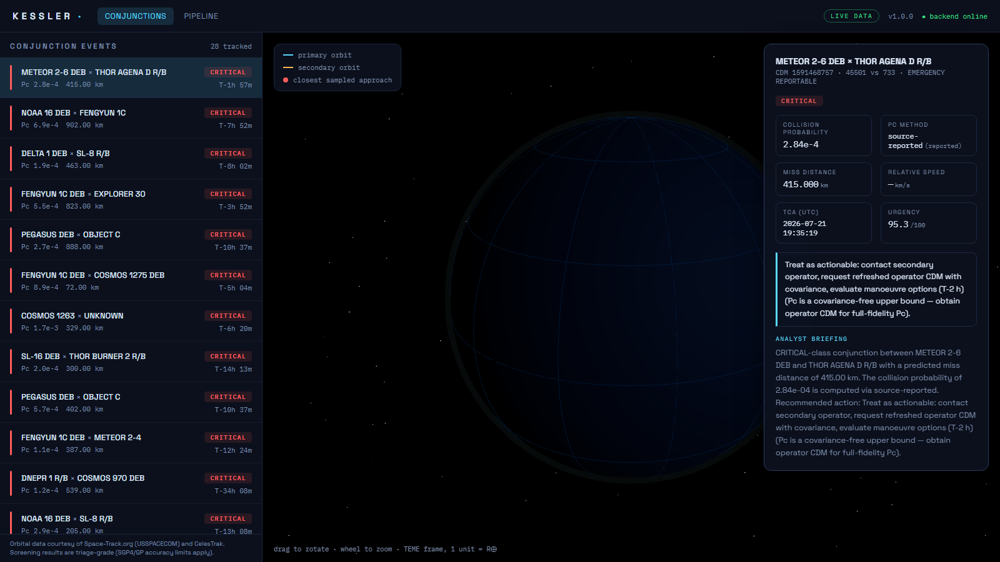

# KESSLER

[](https://github.com/siddhashutosh/kessler/actions/workflows/ci.yml)
[](LICENSE)
[](backend/requirements.txt)
[](backend/tests)

**Open Orbital Conjunction Assessment & Risk Toolkit** — an open-source pipeline that ingests
public space-surveillance data (Conjunction Data Messages + GP orbital elements), computes and
verifies collision probability (Pc), classifies orbital-collision risk, and presents everything
through a REST API and a 3D web dashboard.

> Named for the Kessler Syndrome — the debris-cascade scenario this class of tooling exists to prevent.


*Live mode: real conjunction events from today's Space-Track public feed, urgency-ranked,
with dual-method collision probability and an AI/template analyst briefing per event.*

## Use the math without the app

The astrodynamics core ships as a standalone package (no FastAPI, no UI):

```bash
pip install kessler-toolkit   # CDM parsing · Foster/Chan/Max-Pc · SGP4 screening · risk triage
```

```python
from kessler_toolkit import parse_cdm_kvn, compute_pc
cdm = parse_cdm_kvn(open("conjunction.cdm").read())
result = compute_pc(miss_m=cdm.miss_distance_m, hbr_m=20.0,
                    r_rel_m=cdm.rel_position_rtn_m, v_rel_ms=cdm.rel_velocity_rtn_ms,
                    cov1_m2=cdm.sat1.cov_rtn_m2, cov2_m2=cdm.sat2.cov_rtn_m2)
print(result.value, result.method)   # Foster 2-D, cross-checked against Chan's series
```

See [`packages/kessler-toolkit/`](packages/kessler-toolkit/) — generated from
`backend/app/logic/` (the source of truth) and CI-verified to stay in sync.

## Why

- NASA's reference conjunction-assessment tooling (CARA) is MATLAB-only; no lightweight open
  Python library covers CDM parsing + Pc computation.
- The US TraCSS programme is beginning to distribute standardized CDMs to all satellite
  operators — a wave of new consumers who need free tooling.
- Full research and requirements: see `documents/` (SRS, HLD, LLD as PDF).

## Architecture (short version)

```
CelesTrak (OMM/JSON)  Space-Track (cdm_public)      <- free, public, rate-limit-respected
        │                     │
        ▼                     ▼
  ┌─ service layer ─ orchestration, caching (SQLite, cache-first), clients ─┐
  │  ┌─ logic layer ─ pure astrodynamics & risk math ────────────────────┐  │
  │  │  CDM parser (KVN + JSON) · SGP4 propagation · screening sieve     │  │
  │  │  Foster 2D Pc + Chan cross-check + Max-Pc bound · risk engine     │  │
  │  └─────────────────────────────────────────────────────────────────-┘  │
  └── FastAPI /api/v1 ──────────────────────────────────────────────────---┘
        │
        ▼
  React + Three.js dashboard  ·  live n8n-style pipeline diagram
```

Six pipeline "agents" (Catalog Sync → CDM Ingest → Parser → Pc Engine → Risk Analyst →
Publisher) — visualised live at `/pipeline` in the UI and in
`documents/diagrams/pipeline-flow.html`.

## Repository layout

```
documents/   SRS, HLD, LLD (PDF + HTML sources), n8n-style diagram, QA report
backend/     Python 3.11+ · FastAPI  (app/logic = pure math, app/service = orchestration)
ui/          Vite + React + TypeScript + Three.js
```

## Run locally

### Backend (port 8000)

```powershell
cd backend
python -m venv .venv
.venv\Scripts\pip install -r requirements.txt
.venv\Scripts\python -m uvicorn app.main:app --port 8000
```

Runs in **Demo Mode** out of the box (bundled sample CDMs + catalogue, zero credentials).
For live data, copy `.env.example` to `.env` and add Space-Track credentials; add
`KESSLER_ANTHROPIC_API_KEY` to enable AI analyst briefings (falls back to templates otherwise).

### UI (port 5173)

```powershell
cd ui
npm install
npm run dev
```

Open http://localhost:5173 — the Vite dev server proxies `/api` to the backend.

### Tests

```powershell
cd backend
.venv\Scripts\python -m pytest tests -q
```

## API

Interactive docs at http://localhost:8000/docs. Key endpoints:

| Endpoint | Purpose |
|---|---|
| `GET /api/v1/conjunctions` | Urgency-ranked conjunction events |
| `GET /api/v1/conjunctions/{id}` | Full event detail (Pc method, cross-check, action) |
| `GET /api/v1/conjunctions/{id}/insight` | AI/template analyst briefing |
| `POST /api/v1/screening/run` | Screen an asset against the catalogue (SGP4) |
| `GET /api/v1/satellites/{norad}/track` | Ground track + ECI orbit points |
| `GET /api/v1/pipeline/status` | Live agent pipeline status |

## Data sources & attribution

Orbital data courtesy of **Space-Track.org** (USSPACECOM) and **CelesTrak**. Basic SSA data is
redistributed under USSPACECOM's blanket approval with citation. Space-Track rate limits
(<30 req/min, <300 req/hr) are enforced by a client-side governor; the architecture is
cache-first by design. Screening results are triage-grade (SGP4/GP accuracy limits apply) —
this is not an operational collision-avoidance service.

## Documents & pitch

Aerospace-style documentation ships with the repo: [SRS](documents/KESSLER-SRS-v1.0.pdf) ·
[HLD](documents/KESSLER-HLD-v1.0.pdf) · [LLD](documents/KESSLER-LLD-v1.0.pdf) ·
[QA report](documents/KESSLER-QA-Report-v1.0.pdf) · interactive
[pitch deck](documents/pitch/kessler-pitch.html) and [demo script](documents/pitch/DEMO-SCRIPT.md) ·
[n8n-style pipeline diagram](documents/diagrams/pipeline-flow.html) (also live in the UI at `/pipeline`).

## Contributing

See [CONTRIBUTING.md](CONTRIBUTING.md) — good first issues include a SOCRATES
cross-check, TLE file import, a Docker image, and an operator-CDM ingestion endpoint.

## Roadmap

- Operator-grade KVN CDMs with full covariance (parser already supports them)
- AWS deployment (EventBridge scheduler, RDS/S3 behind the existing `CacheService` seam)
- Probabilistic space-weather driver forecasting (phase 2 — "open orbital risk stack")

## License

Apache-2.0 — see [LICENSE](LICENSE).
